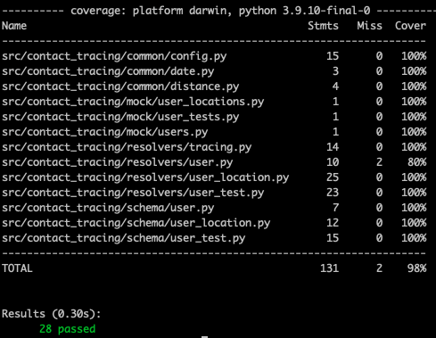

# Contact Tracing GraphQL API

A GraphQL API that takes a user's location as input and returns whether they have been exposed to other users who are COVID-positive.

## Requirements

contact-tracing requires Python 3.7 or above.

<details>
<summary>To install Python, I recommend using <a href="https://github.com/pyenv/pyenv"><code>pyenv</code></a>.</summary>

```bash
# install pyenv
git clone https://github.com/pyenv/pyenv ~/.pyenv

# setup pyenv (you should also put these three lines in .bashrc or similar)
export PATH="${HOME}/.pyenv/bin:${PATH}"
export PYENV_ROOT="${HOME}/.pyenv"
eval "$(pyenv init -)"

# install Python 3.7
pyenv install 3.7.12

# make it available globally
pyenv global system 3.7.12
```
</details>

## Installation

Nothing easier! There is a Makefile setup for you. `make help` to see all the available actions!

```bash
cd contact-tracing
make setup
```

!!! note
    If it fails for some reason,
    you'll need to install
    [PDM](https://github.com/pdm-project/pdm)
    manually.

    You can install it with:

    ```bash
    python3 -m pip install --user pipx
    pipx install pdm
    ```

    Now you can try running `make setup` again,
    or simply `pdm install`.

You now have the dependencies installed.

You can run the application with `pdm run dev-server [ARGS...]`.

## Tasks

This project uses [duty](https://github.com/pawamoy/duty) to run tasks.
A Makefile is also provided. The Makefile will try to run certain tasks
on multiple Python versions. If for some reason you don't want to run the task
on multiple Python versions, you can do one of the following:

1. `export PYTHON_VERSIONS= `: this will run the task
   with only the current Python version
2. run the task directly with `pdm run duty TASK`

The Makefile detects if a virtual environment is activated,
so `make` will work the same with the virtualenv activated or not.

## Running

Even easier than that!

```bash
make dev-server
```
or 
```bash
pdm run dev-server
```
<strong>A postman collection with GraphQL queries can be found [here](https://www.getpostman.com/collections/c5f9bb437db05be90398).</strong>

If you want to execute the test suite:

```bash
make test
```

Specific tests can be run using the match parameter or running the native `pytest` command.

```bash
make test match=training
```
or 
```bash
pdm run pytest -c config/pytest.ini --cov-config config/coverage.ini -k "training"
```
The code coverage of the test suite is currently `98%`.

## Folder structure
```
├── src/
│   └── contact-tracing/
│       ├── __main__.py
│       ├── schema/
│       │   ├── schema.py
│       │   └── user.py
│       │   └── user_test.py
│       │   └── user_location.py
│       │   └── tracing.py
│       ├── common/
│       │   └── config.py
│       │   └── date.py
│       │   └── distance.py
│       ├── resolvers/
│       │   └── user.py
│       │   └── user_location.py
│       │   └── user_test.py
│       │   └── tracing.py
│       ├── server.py
│       └── mock/
│       │   └── users.py
│       │   └── user_locations.py
│       │   └── user_tests.py
── tests/
    └── fixtures/
    └── common/
        └── test_date.py
        └── test_distance.py
    └── resolvers/
        └── test_tracing.py
        └── test_user_location.py
        └── test_user_tests.py
```

- `server.py`: the main entry point for the service.
- `schema`: the GraphQL schemas.
- `resolver`: the GraphQL resolvers that are responsible for data fetching.
- `common`: the common code with config and utility methods.
- `tests`: the test suite.

## TODO

- Remove data mocking and a database, probably Postgres. Development with Postgres is currently a pain due to [psycopg2 installation issue on M1](https://github.com/psycopg/psycopg2/issues/1286).

## Extensions 
- Change data layer to use Neo4j due to efficient spatial and temporal queries. Possible query - 
```
MATCH (p:Person {healthstatus:$status})-[v:VISITS]->(pl:Place)
 WHERE p.confirmedtime < v.starttime
 RETURN distinct pl.name as place LIMIT 20
```
- Move to asynchronous workflow with a clustering algorithm like `DBSCAN` using euclidean distance and time as distance metrics.

## Postman Collection
<strong>A postman collection with GraphQL queries can be found [here](https://www.getpostman.com/collections/c5f9bb437db05be90398).</strong>